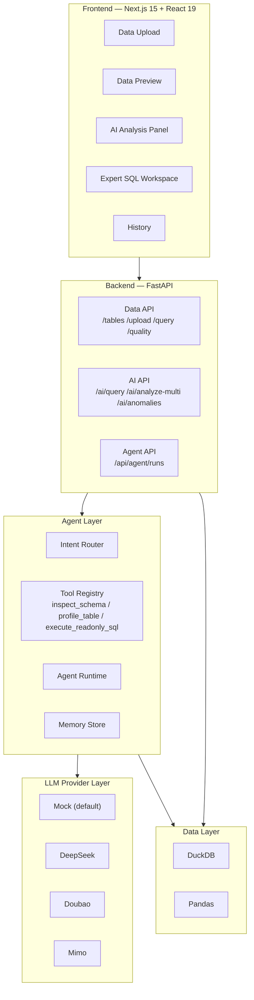

# Enterprise AI Data Agent — AI-Powered Data Analysis for Excel & CSV

中文版: [README.md](README.md)


## Table of Contents

- [Overview](#overview)
- [Why This Exists](#why-this-exists)
- [Core Capabilities](#core-capabilities)
- [Architecture](#architecture)
- [Core Workflow](#core-workflow)
- [Quantified Results](#quantified-results)
- [Quick Start](#quick-start)
- [API Examples](#api-examples)
- [Project Boundaries](#project-boundaries)
- [FAQ](#faq)
- [Glossary](#glossary)
- [Contributing](#contributing)
- [License](#license)

## Overview

Enterprise AI Data Agent is an AI-powered data analysis platform for Excel and CSV datasets. You upload a file, ask questions in plain English, and the Agent autonomously calls a tool chain — inspecting the schema, generating SQL, executing queries, and explaining results — while keeping a full memory and trace record of every step.

This is not a simple natural-language-to-SQL converter. It's a complete analysis pipeline built around: upload → schema understanding → tool calling → SQL execution → result explanation → memory → trace. Advanced users can switch to Expert SQL mode and write queries by hand.

## Why This Exists

- **Business users don't write SQL.** They have Excel and CSV data they want to analyze, but lack the SQL skills and find traditional BI tools hard to learn.
- **Table schemas are opaque.** Column names alone rarely convey what the data means or what questions are worth asking.
- **One-shot AI SQL has no memory or trace.** A single NL→SQL call can't remember past analyses, build on prior findings, or show the reasoning behind each step.
- **Most tools sit at one extreme or the other.** Spreadsheet tools aren't smart enough; AI agent demos lack real data plumbing — no upload, no persistent queries, no history, no report archive.

## Core Capabilities

| Capability | Problem It Solves | How It Works | Status |
| --- | --- | --- | --- |
| Excel / CSV Upload | Getting local data into the system | File upload → DuckDB table creation with automatic column type inference | ✅ Implemented |
| Schema Detection & Preview | Understanding what fields and data are in the table | Schema detection, type mapping, data preview, row count | ✅ Implemented |
| Data Quality Reports | Spotting nulls, duplicates, and outliers | Missing values, duplicates, outlier detection, quality scoring (completeness / consistency / validity / uniqueness) | ✅ Implemented |
| Natural Language Analysis | Analyzing data without writing SQL | User asks a question → AI generates SQL → read-only execution → results + explanation | ✅ Implemented |
| Agent Tool Calling | Letting the AI autonomously run multi-step analysis | Agent runtime with intent routing, tool registry (inspect_schema / profile_table / execute_readonly_sql), simulated tool chain | ✅ Basic skeleton implemented; tool chain currently uses deterministic mock data |
| Multi-Provider with Fallback | Lowering the barrier to use real LLMs | Supports Mock / DeepSeek / Doubao / Mimo; Mock is the default zero-config mode; automatic fallback when a real provider is unavailable | ✅ Implemented |
| Streaming Output | Seeing analysis progress in real time | SSE streaming with progressive rendering of plan, step results, and summary | ✅ Implemented |
| Memory & Context | Remembering prior analyses across conversation turns | AI session store managing conversation history, context compression, and accumulated key findings | ✅ Implemented |
| Run Trace | Auditing every reasoning step and token cost | TraceRecorder captures latency, tokens, input context, SQL, and guardrail violations per LLM call | ✅ Implemented |
| Expert SQL Mode | Giving advanced users full control | Monaco Editor with keyword/table/column autocomplete, multi-tab editing, query history, export (CSV / JSON / Excel) | ✅ Implemented |
| Analysis Reports & History | Saving and revisiting past analyses | AnalysisRun records, starring/bookmarking, report detail view (Summary / Findings / Result / SQL Appendix) | ✅ Implemented |
| Analysis Templates | Reusing proven analysis workflows | Save a run as a template, adapt it to a new dataset | ✅ Implemented |
| Anomaly Detection | Automatically spotting outliers in the data | Z-score / IQR statistical detection + LLM business interpretation | ✅ Implemented |
| Docker Local Demo | Minimizing local setup friction | Docker Compose one-command startup, default Mock LLM mode | ✅ Implemented |

> **Note**: The Agent tool calling chain currently runs in deterministic mock mode, returning sample data. The codebase includes real executor and generator injection paths (`pipeline_adapter.py`) for enabling the full Agent tool chain when a real LLM provider is configured.

## Architecture



| Layer | Stack | Notes |
| --- | --- | --- |
| Frontend | Next.js 15 / React 19 / TypeScript / Tailwind CSS / Monaco Editor / Recharts | Analysis workspace, SQL editor, data preview, AI analysis panel, history |
| Backend | FastAPI / Pydantic / Uvicorn | REST API + SSE streaming, request validation, auto-generated API docs |
| Data | DuckDB / Pandas / openpyxl | Embedded OLAP engine, CSV/Excel parsing, data quality analysis |
| Agent | Intent Router + Tool Registry + Runtime + Memory Store | Intent classification, tool definitions and invocation, runtime orchestration, context memory |
| LLM | Mock / DeepSeek / Doubao / Mimo (OpenAI-compatible) | Multi-provider adapters, automatic fallback, zero-config Mock default |
| State | React Query (server) / Zustand (client) | Cache and polling / local state with persistence |
| Testing | pytest / Vitest / Playwright | 796 backend tests / 1,171 frontend tests / E2E |
| Deployment | Docker / Docker Compose / GitHub Actions | Local demo deployment / CI |

## Core Workflow

The complete user journey:

1. **Upload Data** — Upload an Excel or CSV file. The system creates a DuckDB table automatically.
2. **Understand the Data** — Browse table structure, column types, data preview, and quality reports.
3. **Ask a Question** — Type an analysis question in the AI Analysis panel. Pick an LLM provider (Mock is the default).
4. **Agent Classifies Intent** — The Intent Router determines what kind of question this is: simple summary, SQL question, agent analysis, data preview, or unsupported.
5. **Agent Calls the Tool Chain** — It runs inspect_schema → generate_sql → execute_readonly_sql → summarize → build_report in sequence.
6. **Full Results Returned** — The UI shows an analysis summary, key findings, the generated SQL, query results, token usage, guardrail warnings, and trace events.
7. **Advanced Users Can Switch to Expert SQL** — Open the SQL Workspace and write queries directly in Monaco Editor with full autocomplete and multi-tab support.

## Quantified Results

| Metric | Result | Source |
| --- | --- | --- |
| Backend Tests | **796 passed, 31 skipped** | pytest output (Jul 2026) |
| Frontend Tests | **1,171 passed** (48 test files) | Vitest output (Jul 2026) |
| Frontend Build | **PASS** | `npx next build` (Jul 2026) |
| Backend Import | **PASS** | `python -c "from backend.main import app"` (Jul 2026) |
| Docker Compose Local Demo | **verified** | `docker compose config / build / up` pass |
| Mock LLM Default | **Zero-config runnable** | Default `LLM_MODE=mock`, no API key required |
| LLM Providers | **4** (Mock / DeepSeek / Doubao / Mimo) | Backend provider adapter registry |
| Agent Tools | **3** (inspect_schema / profile_table / execute_readonly_sql) | Backend tool registry |
| Supported File Formats | **2** (CSV / Excel .xlsx) | Backend file_loader module |
| API Endpoints | **30+** | FastAPI auto-generated /docs |

> **Note**: All metrics above are engineering validation data (build, test, import, Docker). They do not represent production performance benchmarks or commercial SLA figures.

## Quick Start

### Prerequisites

- Python 3.11+
- Node.js 20+
- Docker Desktop + Docker Compose (if using Docker)

### Docker Compose (Recommended)

```bash
git clone https://github.com/Strange-Men/EnterpriseAiDataAgent.git
cd EnterpriseAiDataAgent
docker compose up --build
```

After startup:

- Frontend: http://localhost:3000
- Backend API Docs: http://localhost:8000/docs
- AI Status: http://localhost:8000/api/ai/status

To stop:

```bash
docker compose down --remove-orphans
```

> Docker Compose defaults to Mock LLM mode — no API key needed. To use a real LLM provider, copy `.env.docker.example` to `.env.docker`, fill in your API key, and uncomment the `env_file` line in `docker-compose.yml`.

### Local Development

**Backend**:

```bash
python -m venv .venv
source .venv/bin/activate  # Windows: .venv\Scripts\activate
pip install -r requirements.txt
uvicorn backend.main:app --reload --host 127.0.0.1 --port 8000
```

**Frontend** (new terminal):

```bash
cd frontend-react
npm install
npm run dev -- --port 3000
```

### Environment Variables

Key configuration (see `.env.example` for the full list):

| Variable | Purpose | Default |
| --- | --- | --- |
| `LLM_MODE` | LLM runtime mode | `mock` |
| `LLM_DEFAULT_PROVIDER` | Default LLM provider | `mock` |
| `LLM_FALLBACK_ON_ERROR` | Auto-fallback on provider error | `true` |
| `DEEPSEEK_API_KEY` | DeepSeek API key (optional) | (empty) |
| `DOUBAO_API_KEY` | Doubao API key (optional) | (empty) |
| `MIMO_API_KEY` | Mimo API key (optional) | (empty) |
| `NEXT_PUBLIC_API_URL` | Backend URL for the frontend | `http://localhost:8000` |

> **Security**: API keys are configured in backend environment variables only. The frontend never holds real keys. Mock mode is the default safe mode — runs with zero keys.

## API Examples

### Upload Data

```bash
curl -X POST http://localhost:8000/api/upload \
  -F "file=@sales_data.csv"
```

### Natural Language Query (AI)

```bash
curl -X POST http://localhost:8000/api/ai/query \
  -H "Content-Type: application/json" \
  -d '{
    "question": "What is the revenue breakdown by channel?",
    "table_name": "sales_data",
    "provider": "mock"
  }'
```

### Direct SQL Query (Expert SQL)

```bash
curl -X POST http://localhost:8000/api/query \
  -H "Content-Type: application/json" \
  -d '{
    "sql": "SELECT channel, SUM(revenue) AS total FROM sales_data GROUP BY channel ORDER BY total DESC"
  }'
```

### Agent Run

```bash
curl -X POST http://localhost:8000/api/agent/runs \
  -H "Content-Type: application/json" \
  -d '{
    "user_input": "Analyze revenue trends and identify key drivers",
    "table_name": "sales_data",
    "provider": "mock"
  }'
```

### Check System Status

```bash
curl http://localhost:8000/api/status
curl http://localhost:8000/api/ai/status
```

Full API documentation: start the backend and visit http://localhost:8000/docs

## Project Boundaries

### What's Implemented

- CSV / Excel upload with automatic DuckDB table creation
- Schema detection, data preview, and quality reports
- Natural language → SQL generation → read-only execution → result explanation
- Expert SQL workspace (Monaco Editor, autocomplete, multi-tab, query history, export)
- Multi-provider LLM support with Mock fallback — zero config runnable
- Agent runtime skeleton: intent routing, tool registry, simulated tool chain execution
- Analysis history, report details, analysis templates, anomaly detection
- SSE streaming output
- Memory / Trace / Guardrails / Token Budget
- Docker Compose local demo
- pytest / Vitest / Playwright test suites

### Mock Fallback Details

- **Mock LLM**: Default mode, returns deterministic simulated results. No API key required.
- **Agent Tool Chain**: Currently runs in deterministic mock mode — tools return sample data. The `pipeline_adapter.py` module provides real executor and generator injection paths.
- **Real Providers**: DeepSeek, Doubao, and Mimo require user-provided API keys, base URLs, and model names.

### Current Limitations & Extension Paths

- **Auth**: Only an optional API key middleware and lightweight rate limiter. Not a production-grade multi-tenant auth system.
- **Data Sources**: CSV and Excel files only. No direct database connections, data lakes, or SaaS data source integrations.
- **Agent System**: Single-agent with a deterministic tool chain skeleton. Multi-agent collaboration, dynamic tool selection, and autonomous planning are future extension areas.
- **Persistence**: Analysis results rely on browser localStorage (Zustand persist) and backend DuckDB files. Not a distributed persistence solution.
- **Deployment**: Docker Compose is for local demo use. Not a production container orchestration setup.
- **File Formats**: CSV and Excel only. JSON, Parquet, and direct database connections are future extension areas.

> This project is not a commercial BI platform. It does not replace Tableau, Power BI, or Metabase. It is an AI agent engineering practice project for the data analysis domain.

## FAQ

### Can I run this without an API key?

Yes. Mock LLM is the default — no API key required. Start with Docker Compose and explore the full workflow.

### Which LLM providers are supported?

Mock (default, zero config), DeepSeek, Doubao (Volcano Ark), and Mimo. Switch providers in the Analyze panel header.

### I configured a real provider but it still falls back to Mock. What's wrong?

Check that all three backend environment variables are set correctly: API Key, Base URL, and Model name. Check the backend logs for the fallback reason. When `LLM_FALLBACK_ON_ERROR=true`, any real provider failure automatically falls back to Mock.

### Where is the data stored?

Uploaded CSV/Excel data is imported into a DuckDB database file (default: `data/enterprise.duckdb`). Analysis history is stored in the browser's localStorage and in the backend DuckDB query history table.

### How large a file can I upload?

The backend enforces a 50 MB upload limit (`MAX_UPLOAD_BYTES=52428800`). DuckDB's OLAP engine can efficiently handle queries on millions of rows.

### Is this a production-grade system?

No. It's an AI agent engineering practice project for the data analysis domain. It does not include production-grade auth, multi-tenant isolation, distributed deployment, or high-availability architecture.

### Are the Agent tool calls real or simulated?

The Agent tool chain (inspect_schema, profile_table, execute_readonly_sql) currently runs in deterministic mock mode, returning sample data. The codebase includes real executor and generator injection paths for enabling the full tool chain with a configured LLM provider.

### What's the difference between Expert SQL and AI Analysis?

Expert SQL is a traditional SQL query workspace for users who know SQL. AI Analysis is a natural language interface where the AI generates and executes SQL for you. Both work on the same DuckDB tables and can be used together.

## Glossary

| Term | Definition |
| --- | --- |
| Agent | An AI analysis agent that understands user intent, selects tools autonomously, and executes multi-step analysis tasks |
| Tool Calling | The Agent invoking specific tools (e.g., inspect schema, execute SQL, generate summary) to complete sub-tasks |
| Memory | Cross-turn conversation context including past questions, SQL, key findings, and compressed summaries |
| AI SQL | SQL queries automatically generated by the AI from natural language questions |
| DuckDB | An embedded OLAP database — no separate server process needed, ideal for local data analysis |
| Provider Fallback | Automatic switch to a backup LLM provider (defaulting to Mock) when the preferred provider is unavailable |
| Trace | An auditable record of the analysis process, including latency, token usage, input context, SQL, and guardrail checks per LLM call |
| Expert SQL | A hand-coded SQL workspace for advanced users, with Monaco Editor, autocomplete, and multi-tab editing |

## Contributing

Issues and PRs are welcome. Please read [CONTRIBUTING.md](CONTRIBUTING.md) before submitting.

## License

MIT License
