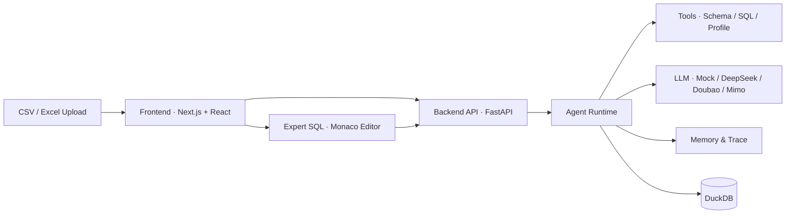

# Enterprise AI Data Agent | 面向 Excel / CSV 数据的 AI 分析 Agent

English version: [README.en.md](README.en.md)


## 目录

- [项目简介](#项目简介)
- [背景与问题](#背景与问题)
- [核心能力](#核心能力)
- [技术架构](#技术架构)
- [核心工作流](#核心工作流)
- [量化结果](#量化结果)
- [快速上手](#快速上手)
- [API 示例](#api-示例)
- [项目边界](#项目边界)
- [常见问题](#常见问题)
- [术语表](#术语表)
- [Contributing](#contributing)
- [License](#license)

## 项目简介

Enterprise AI Data Agent 是一个面向 Excel / CSV 数据分析场景的 AI Data Agent 平台。用户上传数据文件后，用自然语言向 Agent 提问，Agent 自动调用工具链完成表结构理解、SQL 生成、只读执行、结果解释和报告输出，并保留完整的 memory 与 trace 记录。

它不是简单的自然语言转 SQL 工具，而是围绕"数据上传 → 结构理解 → 工具调用 → SQL 执行 → 结果解释 → memory → trace"构建的完整分析流程。高级用户可切换到 Expert SQL 模式手写查询。

## 背景与问题

- **业务人员不会 SQL**：面对 Excel / CSV 数据，想分析但缺乏 SQL 技能，传统 BI 工具学习成本高。
- **数据表结构复杂，字段含义难理解**：仅凭列名无法快速判断字段的业务含义和分析方向。
- **单次 AI SQL 缺少上下文、记忆和可追踪过程**：一次性问答无法记住历史分析结果，也难以追溯每一步的推理依据。
- **普通数据分析工具不够智能，Agent Demo 又常缺少真实数据闭环**：聊完就结束，缺少数据上传、持久化查询、历史回溯、报告沉淀等工程闭环。

## 核心能力

| 能力 | 解决的问题 | 实现方式 | 当前状态 |
| --- | --- | --- | --- |
| Excel / CSV 上传 | 用户如何把本地数据接入系统 | 文件上传 → DuckDB 自动建表，支持 `.csv` 和 `.xlsx`，自动推断列类型 | ✅ 已实现 |
| 表结构识别与预览 | 不了解表里有什么字段和数据 | Schema 检测、字段类型映射、数据预览、行数统计 | ✅ 已实现 |
| 数据质量报告 | 不知道数据有没有缺失值、重复、异常 | 缺失值、重复值、异常值检测，质量评分（完整性/一致性/有效性/唯一性） | ✅ 已实现 |
| 自然语言分析 | 不会写 SQL 也能分析数据 | 用户输入自然语言问题 → AI 生成 SQL → 只读执行 → 返回结果与解释 | ✅ 已实现 |
| Agent 工具调用 | 让 AI 自主完成多步骤分析任务 | Agent runtime 包含 intent 路由、工具注册（inspect_schema / profile_table / execute_readonly_sql）、模拟工具链执行 | ✅ 已具备基础骨架，工具链当前为 deterministic mock |
| 多 Provider 支持与 Fallback | 降低真实 LLM 接入门槛 | 支持 Mock / DeepSeek / Doubao / Mimo；默认 Mock 零配置启动，真实 provider 不可用时自动 fallback | ✅ 已实现 |
| Streaming 流式输出 | 避免长时间等待，实时看到分析进度 | SSE 流式传输，支持分析计划、步骤结果、摘要的渐进式渲染 | ✅ 已实现 |
| Memory 与上下文记忆 | 多轮对话中记住之前的分析结果 | AI session store 管理对话轮次、上下文压缩、key findings 累积 | ✅ 已实现 |
| Run Trace 记录 | 追溯每一步推理过程和 token 消耗 | TraceRecorder 记录每次 LLM 调用的 latency、token、输入、SQL、guardrail violations | ✅ 已实现 |
| Expert SQL 高级模式 | 高级用户可直接手写 SQL | Monaco Editor、关键字/表名/列名自动补全、多标签页、查询历史、导出（CSV/JSON/Excel） | ✅ 已实现 |
| 分析报告与历史 | 分析结果可回溯、可沉淀 | 分析运行记录（AnalysisRun）、星标保存、报告详情（Summary/Findings/Result/SQL Appendix） | ✅ 已实现 |
| 分析模板 | 复用已有的分析流程 | 从分析运行创建模板，适配到新数据集 | ✅ 已实现 |
| 异常检测 | 自动发现数据中的异常值 | Z-score / IQR 统计检测 + LLM 业务解读 | ✅ 已实现 |
| Docker 本地运行 | 降低本地环境搭建成本 | Docker Compose 一键启动前后端，默认 Mock LLM 模式 | ✅ 已实现 |

> **说明**：Agent 工具调用链路当前以 deterministic mock 模式运行，返回模拟数据。项目已预留真实 executor / generator 注入路径（`pipeline_adapter.py`），可在配置真实 LLM provider 后启用完整 Agent tool chain。

## 技术架构



- **Frontend**：Next.js 15 + React 19，分析工作台、AI 分析面板、Expert SQL 编辑器，React Query + Zustand 管理状态。
- **Backend API**：FastAPI，REST + SSE Streaming，请求校验，自动生成 API 文档。
- **Agent Runtime**：Intent Router → Tool Registry → Tool Chain 执行，串联 Tools、Memory、Trace 和 LLM 调用。
- **LLM Providers**：Mock（默认零配置）/ DeepSeek / Doubao / Mimo，OpenAI-compatible 适配，失败自动 fallback。
- **Data Layer**：DuckDB 嵌入式 OLAP 引擎 + Pandas / openpyxl 解析 CSV/Excel，只读 SQL 执行。

## 核心工作流

完整用户链路：

1. **上传数据** — 用户上传 Excel / CSV 文件，系统自动创建 DuckDB 数据表。
2. **理解数据** — 查看表结构、字段类型、数据预览和质量报告，快速了解数据全貌。
3. **提出问题** — 在 AI 分析面板用自然语言输入分析问题，选择 LLM Provider（默认 Mock）。
4. **Agent 判断任务** — Intent Router 分类用户意图（简单汇总 / SQL 问题 / Agent 分析 / 数据预览 / 不支持的请求）。
5. **Agent 调用工具链** — 依次调用 inspect_schema（了解表结构）→ generate_sql（生成 SQL）→ execute_readonly_sql（只读执行）→ summarize（结果解释）→ build_report（报告生成）。
6. **返回完整结果** — 前端展示分析摘要、关键发现（Findings）、SQL 语句、查询结果、Token 消耗、Guardrail 警告和 Trace 事件。
7. **高级用户可选 Expert SQL** — 在 SQL Workspace 中使用 Monaco Editor 手写查询，享受关键字/表名/列名自动补全和多标签页编辑。

## 量化结果

| 指标 | 结果 | 数据来源 |
| --- | --- | --- |
| 后端测试 | **796 passed, 31 skipped** | pytest 运行输出（2026-07） |
| 前端测试 | **1171 passed**（48 test files） | Vitest 运行输出（2026-07） |
| 前端构建 | **PASS** | `npx next build`（2026-07） |
| 后端导入 | **PASS** | `python -c "from backend.main import app"`（2026-07） |
| Docker Compose 本地运行 | **verified** | docker compose config / build / up 验证通过 |
| Mock LLM 默认可用 | **零配置即可运行** | 默认 `LLM_MODE=mock`，无需任何 API Key |
| LLM Provider 数量 | **4**（Mock / DeepSeek / Doubao / Mimo） | 后端 provider adapter 注册 |
| Agent 工具数量 | **3**（inspect_schema / profile_table / execute_readonly_sql） | 后端 tool registry |
| 支持文件格式 | **2**（CSV / Excel .xlsx） | 后端 file_loader 模块 |
| API 端点数量 | **30+** | FastAPI 自动生成的 /docs 文档 |

> **注意**：以上指标均为工程验证数据（build / test / import / Docker），不包含生产环境性能指标或商业 SLA 数据。

## 快速上手

### 环境要求

- Python 3.11+
- Node.js 20+
- Docker Desktop + Docker Compose（如使用 Docker 方式）

### Docker Compose 启动（推荐）

```bash
git clone https://github.com/Strange-Men/EnterpriseAiDataAgent.git
cd EnterpriseAiDataAgent
docker compose up --build
```

启动后访问：

- Frontend: http://localhost:3000
- Backend API Docs: http://localhost:8000/docs
- AI Status: http://localhost:8000/api/ai/status

停止：

```bash
docker compose down --remove-orphans
```

> Docker Compose 默认使用 Mock LLM 模式，不需要任何 API Key。如需真实 LLM Provider，复制 `.env.docker.example` 为 `.env.docker`，填入对应 API Key，并在 `docker-compose.yml` 中取消 `env_file` 行的注释。

### 本地开发启动

**后端**：

```bash
python -m venv .venv
source .venv/bin/activate  # Windows: .venv\Scripts\activate
pip install -r requirements.txt
uvicorn backend.main:app --reload --host 127.0.0.1 --port 8000
```

**前端**（新终端）：

```bash
cd frontend-react
npm install
npm run dev -- --port 3000
```

### 环境变量

核心配置项（完整列表见 `.env.example`）：

| 配置项 | 说明 | 默认值 |
| --- | --- | --- |
| `LLM_MODE` | LLM 运行模式 | `mock` |
| `LLM_DEFAULT_PROVIDER` | 默认 LLM Provider | `mock` |
| `LLM_FALLBACK_ON_ERROR` | Provider 失败时自动 fallback | `true` |
| `DEEPSEEK_API_KEY` | DeepSeek API Key（可选） | 空 |
| `DOUBAO_API_KEY` | Doubao API Key（可选） | 空 |
| `MIMO_API_KEY` | Mimo API Key（可选） | 空 |
| `NEXT_PUBLIC_API_URL` | 前端连接的后端地址 | `http://localhost:8000` |

> **安全提示**：API Key 仅配置在后端环境变量中，前端不包含任何真实 Key。Mock 模式为默认安全模式，无需任何 Key 即可运行。

## API 示例

### 上传数据

```bash
curl -X POST http://localhost:8000/api/upload \
  -F "file=@sales_data.csv"
```

### 自然语言查询（AI）

```bash
curl -X POST http://localhost:8000/api/ai/query \
  -H "Content-Type: application/json" \
  -d '{
    "question": "各渠道的营收分布是怎样的？",
    "table_name": "sales_data",
    "provider": "mock"
  }'
```

### SQL 直接查询（Expert SQL）

```bash
curl -X POST http://localhost:8000/api/query \
  -H "Content-Type: application/json" \
  -d '{
    "sql": "SELECT channel, SUM(revenue) AS total FROM sales_data GROUP BY channel ORDER BY total DESC"
  }'
```

### Agent Run（Agent 分析）

```bash
curl -X POST http://localhost:8000/api/agent/runs \
  -H "Content-Type: application/json" \
  -d '{
    "user_input": "分析营收趋势并找出关键驱动因素",
    "table_name": "sales_data",
    "provider": "mock"
  }'
```

### 查看系统状态

```bash
curl http://localhost:8000/api/status
curl http://localhost:8000/api/ai/status
```

完整 API 文档：启动后端后访问 http://localhost:8000/docs

## 项目边界

### 当前已实现

- CSV / Excel 上传，DuckDB 自动建表
- 表结构识别、数据预览、质量报告
- 自然语言 → SQL 生成 → 只读执行 → 结果解释
- Expert SQL 工作台（Monaco Editor、自动补全、多标签页、查询历史、导出）
- 多 LLM Provider 支持，Mock fallback 零配置可运行
- Agent runtime 骨架：intent 路由、工具注册、模拟工具链执行
- 分析历史、报告详情、分析模板、异常检测
- SSE 流式输出
- Memory / Trace / Guardrails / Token Budget
- Docker Compose 本地 Demo
- pytest / Vitest / Playwright 测试体系

### Mock Fallback 说明

- **Mock LLM**：默认模式，返回确定性模拟结果，不需要任何 API Key。
- **Agent 工具链**：当前为 deterministic mock 模式，工具返回模拟数据。`pipeline_adapter.py` 已预留真实 executor / generator 注入路径。
- **真实 Provider**：DeepSeek / Doubao / Mimo 需用户自行配置 API Key、Base URL 和 Model 名称。

### 当前局限与扩展方向

- **权限系统**：当前仅有可选的 API Key 认证 middleware 和轻量限流，非生产级多租户权限体系。
- **数据源**：当前面向 CSV / Excel 文件分析，不包含数据库直连、数据湖或 SaaS 数据源接入。
- **Agent 系统**：当前为单 Agent + 确定性工具链骨架，不是 Multi-Agent 或自主规划系统。多 Agent 协作、动态工具选择和自主决策为后续扩展方向。
- **持久化**：分析结果依赖前端 localStorage（Zustand persist）和后端 DuckDB 文件，非分布式持久化方案。
- **部署**：Docker Compose 面向本地 Demo 场景，非生产级容器编排。
- **文件格式**：当前支持 CSV 和 Excel，JSON / Parquet / 数据库直连为后续扩展方向。

> 本项目不是商业 BI 平台，不替代 Tableau / Power BI / Metabase。它是一个面向数据分析场景的 AI Agent 工程实践项目。

## 常见问题

### 没有 API Key 能运行吗？

可以。默认使用 Mock LLM，不需要任何 API Key。Docker Compose 启动即可体验完整流程。

### 支持哪些 LLM Provider？

Mock（默认，零配置）、DeepSeek、Doubao（豆包/火山方舟）、Mimo。前端 Analyze 面板顶部可切换 Provider。

### 配置了真实 Provider 但仍然 fallback 到 Mock 怎么办？

检查后端环境变量是否正确：API Key、Base URL、Model 名称缺一不可。查看后端日志中的 fallback 原因。`LLM_FALLBACK_ON_ERROR=true` 会在真实 Provider 不可用时自动回退到 Mock。

### 数据存在哪里？

上传的 CSV / Excel 数据导入 DuckDB 数据库文件（默认 `data/enterprise.duckdb`），分析历史记录存储在前端浏览器 localStorage 和后端 DuckDB 查询历史表中。

### 支持多大的数据文件？

后端上传限制 50MB（`MAX_UPLOAD_BYTES=52428800`）。DuckDB 的 OLAP 引擎可高效处理百万行级别的查询。

### 这个项目是生产级系统吗？

不是。它是一个面向数据分析场景的 AI Agent 工程实践项目。当前不包含生产级权限体系、多租户隔离、分布式部署和高可用架构。

### Agent 工具调用是真实的还是模拟的？

当前 Agent 工具链（inspect_schema / profile_table / execute_readonly_sql）以 deterministic mock 模式运行，返回模拟数据。项目已预留真实 executor / generator 注入路径，可在配置完整环境后启用真实工具链。

### Expert SQL 和 AI 分析有什么区别？

Expert SQL 是传统 SQL 查询工作台，适合会写 SQL 的高级用户。AI 分析是自然语言入口，由 AI 自动生成 SQL 并执行。两者共享同一套 DuckDB 数据表，可以混合使用。

## 术语表

| 术语 | 说明 |
| --- | --- |
| Agent | AI 分析代理，能理解用户意图、自主选择工具并执行多步骤分析任务 |
| Tool Calling | Agent 调用具体工具（如查看表结构、执行 SQL、生成摘要）完成子任务 |
| Memory | 跨轮次对话的上下文记忆，包括历史问题、SQL、关键发现和压缩摘要 |
| AI SQL | 由 AI 根据自然语言问题自动生成的 SQL 查询语句 |
| DuckDB | 嵌入式 OLAP 数据库，无需独立服务进程，适合本地数据分析场景 |
| Provider Fallback | 当首选 LLM Provider 不可用时，自动切换到备用 Provider（默认 fallback 到 Mock） |
| Trace | 分析过程的可追溯记录，包括每次 LLM 调用的 latency、token 消耗、输入上下文、SQL 和 guardrail 检查结果 |
| Expert SQL | 面向高级用户的手写 SQL 工作台，提供 Monaco Editor、自动补全和多标签页编辑 |

## Contributing

欢迎提交 Issue 或 PR。提交前请阅读 [CONTRIBUTING.md](CONTRIBUTING.md)。

## License

MIT License
